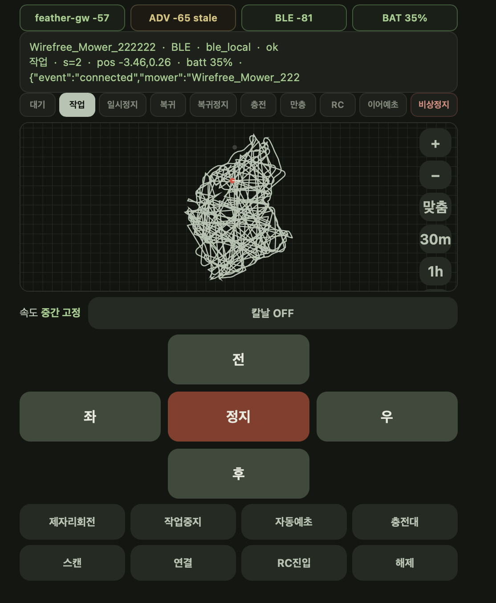
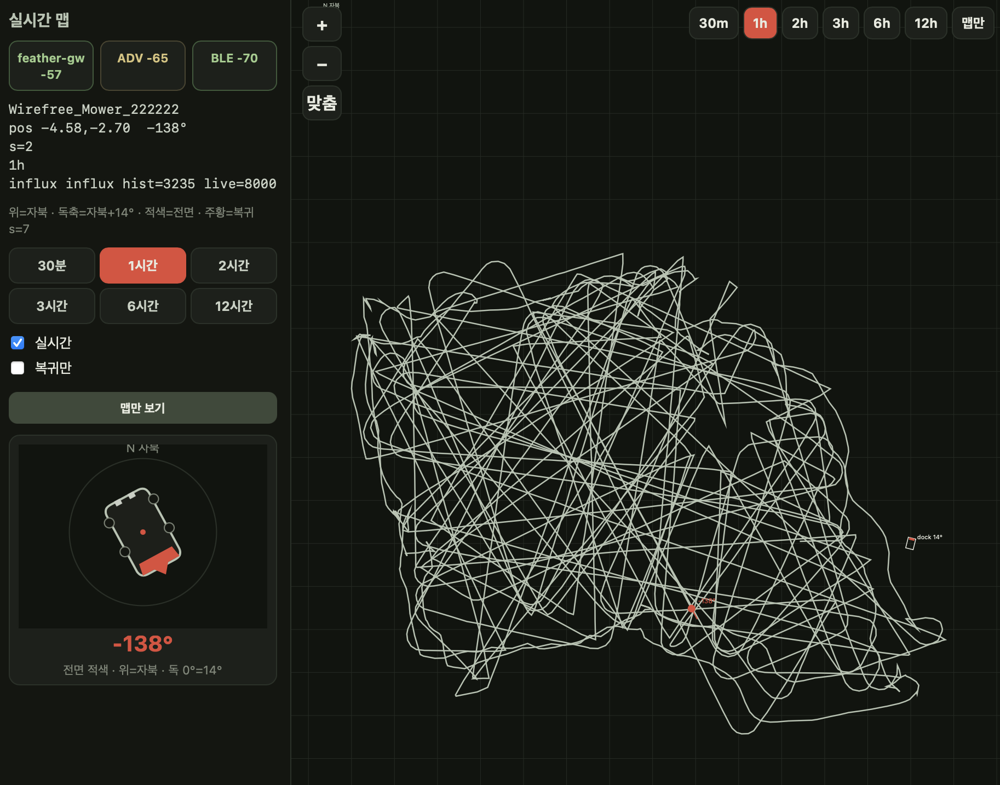

# Sunseeker V3 Robot Lawn Mower BLE 게이트웨이 · 위치 맵 뷰어 · 컨트롤 패드

Sunseeker V3 Robot Lawn Mower 를 **BLE 로 직접** 제어하고 위치(pos)를 보는 도구 모음.
ESP32 Feather 가 잔디깎이에 BLE 로 붙어 MQTT 와 중계하고, PC 의 Python 스크립트가 브라우저 UI 를 띄운다.

| BLE 컨트롤 패드 (`mower_mqtt_pad.py`) | 실시간 맵 뷰어 (`mower_live_map.py`) |
|---|---|
|  |  |
| 상태 칩(GW/ADV/BLE/BAT), 작업 상태 버튼, 미니맵, D-pad, 칼날·자동예초·충전대·스캔/연결 | 시간 범위(30분~12시간) 궤적, 방향 나침반(자북 기준), 맵만 보기 |

```
[Mower] ⇄ BLE(AES-256-ECB + Base64 JSON) ⇄ [ESP32 Feather GW] ⇄ MQTT ⇄ [mower_mqtt_pad.py / mower_live_map.py] ⇄ 브라우저
                                                                         └─ InfluxDB v2 (궤적 이력, 선택)
```

## 파일

| 파일 | 설명 |
|---|---|
| `sunseeker_ble_gw/sunseeker_ble_gw.ino` | ESP32 펌웨어. WiFi+MQTT+BLE 게이트웨이 (LoRa/GPS/TFT 없음) |
| `sunseeker_ble_gw/secrets.h.example` | WiFi/MQTT 접속 정보 템플릿 → `secrets.h` 로 복사 |
| `mower_mqtt_pad.py` | 브라우저 조종 패드 (http://127.0.0.1:8765). 전/후/좌/우, 칼날, 자동예초, 충전대 복귀, 미니맵 |
| `mower_live_map.py` | 제어 없는 실시간 위치 맵 (http://127.0.0.1:8767). BLE pos + Influx 궤적 |
| `mower.env.example` | Python 공통 설정 템플릿 → `mower.env` 로 복사 |
| `requirements.txt` | Python 의존성 (`paho-mqtt`) |
| `docs/images/` | 스크린샷 |
| `LICENSE` | MIT |

## 하드웨어

- Adafruit HUZZAH32 ESP32 Feather (CP2104 USB), 배터리 전압 A13(GPIO35, 1/2 분압), LED GPIO13
- Sunseeker V3 Robot Lawn Mower (BLE 이름 `Wirefree_Mower_*`, `Wireless_Mower_*`, `Mower_*`)
- MQTT 브로커 (예: Mosquitto), 선택: InfluxDB v2

## 설정

### 펌웨어 (Arduino)

- 보드 패키지: **esp32 by Espressif** (3.x 확인), 보드 **Adafruit ESP32 Feather** (`esp32:esp32:featheresp32`), Upload 921600
- 라이브러리: **NimBLE-Arduino 2.4 이상** (`setConnectRetries` 사용, 2.3.x 는 컴파일 실패), **PubSubClient**, **ArduinoJson 7.x**
- 기본 파티션에서 플래시 약 90% 사용. 공간이 부족하면 Partition Scheme 을 Huge APP 등으로 변경

```bash
cp sunseeker_ble_gw/secrets.h.example sunseeker_ble_gw/secrets.h   # 값 입력
arduino-cli lib install "NimBLE-Arduino" PubSubClient ArduinoJson
arduino-cli compile --fqbn esp32:esp32:featheresp32 sunseeker_ble_gw
arduino-cli upload  --fqbn esp32:esp32:featheresp32 -p /dev/cu.SLAB_USBtoUART sunseeker_ble_gw
```

### Python

```bash
python3 -m pip install -r requirements.txt
cp mower.env.example mower.env     # MQTT/Influx 값 입력 (또는 환경변수 export)
python3 mower_mqtt_pad.py          # 조종 패드 → http://127.0.0.1:8765
python3 mower_live_map.py          # 위치 맵   → http://127.0.0.1:8767  (?map=1 이면 맵만)
```

같은 LAN 의 폰에서는 `http://<PC IP>:8765` 로 접속 (0.0.0.0 바인딩).

## 시크릿 설정

실제 값은 저장소에 넣지 않는다. 아래 파일은 `.gitignore` 에 포함됨.

| 대상 | 파일 / 변수 |
|---|---|
| 펌웨어 WiFi, MQTT | `sunseeker_ble_gw/secrets.h` (`WIFI_SSID`, `WIFI_PASS`, `MQTT_HOST`, `MQTT_PORT`, `MQTT_USER`, `MQTT_PASS`) |
| Python MQTT | `MQTT_HOST`, `MQTT_PORT`, `MQTT_USER`, `MQTT_PASS` (환경변수 또는 `mower.env`) |
| InfluxDB | `INFLUX_URL`, `INFLUX_ORG`, `INFLUX_BUCKET`, `INFLUX_TOKEN` (`influx.env`, `influx.token` 도 읽음) |
| 스냅샷 (live map, 선택) | `GO2_SNAP_URL` — 비우면 `/snap` 비활성 |
| GPS 원점 (pad, 선택) | `MOWER_GPS_LAT0`, `MOWER_GPS_LON0` — `gps/rover` 좌표 변환용 |

환경변수가 이미 있으면 파일 값보다 우선한다. `secrets.h` 가 없으면 펌웨어는 `#error` 로 멈춘다.
BLE 암호화 키 `NOLINE_AES_KEY` 는 시크릿이 아니다. 제조사 앱에서 리버스 엔지니어링으로 얻은 고정 키로, HA 통합 [Sunseeker-lawn-mower](https://github.com/Sdahl1234/Sunseeker-lawn-mower) 에 공개된 키와 같다. 스케치에 상수로 포함되어 있다.

## MQTT 토픽

| 토픽 | 방향 | 내용 |
|---|---|---|
| `mower/cmd` | → GW | 명령 (JSON `{"cmd":...}` 또는 평문 `fwd` 등) |
| `mower/status` | GW → | 상태 JSON (ble, rc, adv_rssi, wifi_rssi, vbat, s=작업상태, elec=배터리 % 등). 2초, 충전 중 10초 |
| `mower/notify` | GW → | 이벤트 (found, connected, ble_drop, arrived …) |
| `mower/lwt` | GW → | `online` / `offline` (retain) |
| `mower/ble/tx`, `mower/ble/rx` | GW → | BLE 송수신 평문 JSON 로그 |
| `mower/report`, `mower/yolo`, `gps/rover` | 외부 → | 스크립트가 구독만 함 (이 저장소에 발행 코드 없음) |

### 명령 (`mower/cmd`)

```bash
mosquitto_pub -t mower/cmd -m '{"cmd":"connect"}'
mosquitto_pub -t mower/cmd -m '{"cmd":"fwd","ms":800,"speed":"slow"}'
mosquitto_pub -t mower/cmd -m '{"cmd":"goto","x":1.5,"y":-2.0,"arrive":0.5}'
mosquitto_pub -t mower/cmd -m stop
```

| cmd | 동작 |
|---|---|
| `scan` / `connect` / `disconnect` | BLE 재스캔 / 연결 / 해제(재연결 안 함, 스캔만 유지) |
| `handshake` | 상태 조회 후 RC 모드 진입 |
| `fwd`(1) `rev`(2) `left`(3) `right`(4) `spin`(5) | 이동. `v`, `w`, `ms`/`seconds`, `speed`(slow/medium/fast) 옵션. `ms` 최대 2000 |
| `drive` / `hold` | 임의 `v`,`w` 로 이동 / 계속 유지 |
| `stop`(0) | 정지 (복귀·작업 중이면 RC 진입 후 정지) |
| `blade` | `{"on":true}` 칼날 ON/OFF |
| `speed` | `level`: slow / medium / fast |
| `start` / `pause` / `home` | 자동예초 / 일시정지 / 충전대 복귀 |
| `goto` | 목표 `x`,`y`(m)로 pos 기반 주행 |
| `status` | 상태 즉시 발행 |

## BLE 프로토콜 메모 (코드 기준)

- 서비스 UUID `6e400001-b5a3-f393-e0a9-e50e24dcca91` (NUS 유사)
  - Write `6e400002-…-e50e24dcca93`, Notify `6e400003-…-e50e24dcca95`
  - 대체: Write `0000abf3-0000-1000-8000-00805f9b34fb`, Notify `0000abf4-…`
- 페이로드: JSON → PKCS7 패딩 → **AES-256-ECB** → Base64 로 Write. Notify 는 역순 복호화 ("noline_encrypted"). 키는 앱에서 리버스 엔지니어링한 고정 키 (`NOLINE_AES_KEY`, 스케치에 포함). [Sunseeker-lawn-mower](https://github.com/Sdahl1234/Sunseeker-lawn-mower) 에 공개된 키와 동일
- 요청 형식: `{"id":"...","method":"get_property|action","params":{...}}`
  - 조회: `getfc_state`, `status`, `fault`, `elec`, `build_map_status`, `robot_pos`
  - 조작: `remote_ctl` (`v` 선속도, `w` 각속도, `b:{h,s}` 칼날), `start`, `pause`, `start_find_charger`, `ble_disconnect`
  - RC 진입: `remote_ctl` 에 `v:-1, w:0`
- 응답: `data.robot_pos.point=[x,y]`, `data.robot_pos.angle`(rad), `data.status`, `data.fault`, `data.elec`
- 좌표: 도크가 (0,0), `a=0` 방향이 +Y
- 작업 상태 `s`: 1 대기, 2 작업, 3 일시정지, 7 복귀, 8 복귀정지, 9 충전, 10 만충, 11 RC, 14 이어예초, 18 비상정지
- 연결 파라미터: MTU 512, interval 24–40 (30–50 ms), supervision timeout 8 s (WiFi 공존 여유)

## 참고

- `mower_live_map.py` 의 맵은 자북을 위로, 도크 축을 자북+14° 로 가정해 회전 표시한다 (`DOCK_MAG_DEG`).
- 비공식 리버스 엔지니어링 결과물이다. 사용에 따른 책임은 사용자에게 있다.

## 크레딧

Home Assistant 통합 [Sunseeker-lawn-mower](https://github.com/Sdahl1234/Sunseeker-lawn-mower) (Sdahl1234) 를 참고해 만들었다.

## 라이선스

MIT License — [LICENSE](LICENSE) 참고. Copyright (c) 2026 chaeplin
