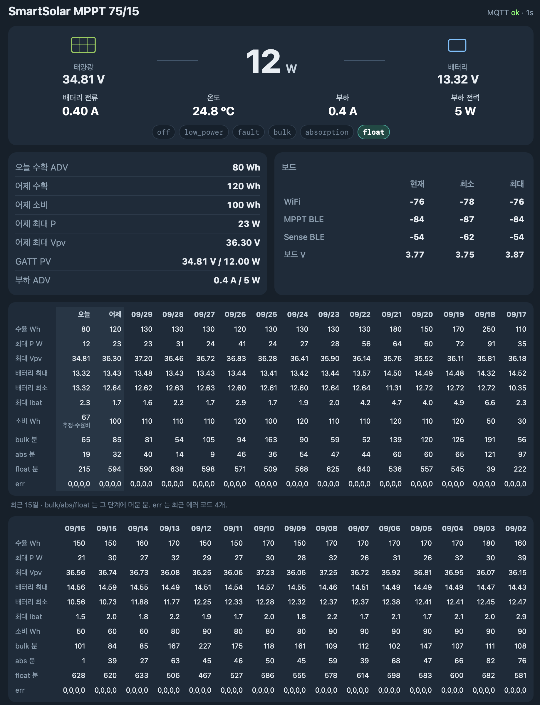
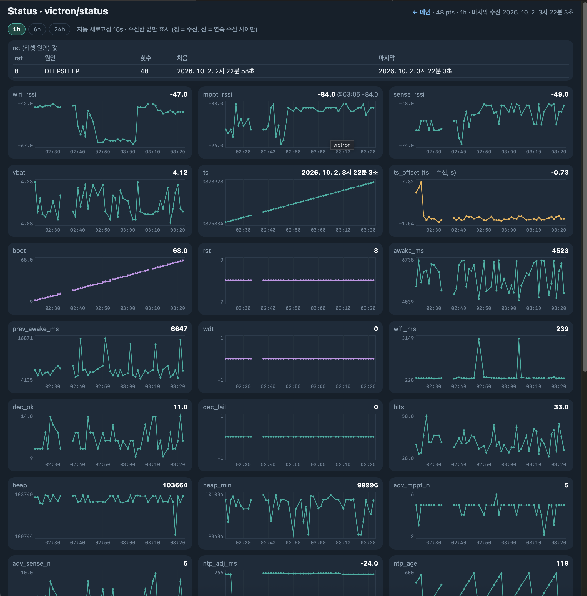

# victron-ble-mqtt

Adafruit **HUZZAH32 (ESP32 Feather)** 가 deep sleep 으로 1분마다 깨어나 Victron **SmartSolar MPPT** (+ Smart Battery Sense) 의 BLE Instant Readout 광고(ADV)를 복호화·평균해서 MQTT 로 올리고, 10분마다 짧게 GATT 로 연결해 **일일 이력(history)** 과 **PV 전압/전력** 을 읽는 브리지입니다. `victron_mqtt_view.py` 는 그 값을 보여 주는 로컬 웹 뷰어입니다.

Victron 공식 SDK/샘플이 아닙니다. GATT 패킷 형식은 VictronConnect 캡처와 시리얼 로그로 맞춘 것입니다.

## 구성

```
victron_gatt_bridge_feather/
  victron_gatt_bridge_feather.ino   펌웨어 (폴더 이름 = .ino 이름)
  secrets.h.example                 → secrets.h 로 복사해서 채움 (git 제외)
victron_mqtt_view.py                뷰어 (MQTT + 선택적 InfluxDB)
.env.example                        → .env 로 복사 (git 제외)
requirements.txt
```

## 하드웨어 / 라이브러리

- Adafruit HUZZAH32 – ESP32 Feather (`esp32:esp32:featheresp32`), VBAT = A13/GPIO35 측정
- Victron SmartSolar MPPT (BLE, Instant Readout 키 + PIN), 선택: Smart Battery Sense
- Arduino esp32 core **3.3.12**, **NimBLE-Arduino 2.3.6**, **PubSubClient 2.8** (ArduinoJson 은 사용하지 않음)
- 뷰어: Python 3.9+, `pip install -r requirements.txt` (paho-mqtt 1.x/2.x 모두 동작)

```sh
cp victron_gatt_bridge_feather/secrets.h.example victron_gatt_bridge_feather/secrets.h   # 값 채우기
arduino-cli compile --fqbn esp32:esp32:featheresp32 victron_gatt_bridge_feather
cp .env.example .env && python3 victron_mqtt_view.py     # http://127.0.0.1:8772
```

`secrets.h`: Wi-Fi SSID/비밀번호, MQTT 호스트/사용자/비밀번호, Victron PIN, 기기별 시리얼·MAC·AES 키, (선택) 고정 IP.
`.env`: `MQTT_HOST/PORT/USER/PASS`, `HTTP_HOST/PORT`, `INFLUX_URL/ORG/BUCKET/TOKEN` (기본값 127.0.0.1).

## 동작 주기

| 언제 | 하는 일 |
|---|---|
| 매 분 (RTC 시계 기준 정각) | BLE 스캔(100 % duty, interval = window = 100 ms) → 기기당 ADV 5개(최대 6 s) 평균 → `victron/mppt`, `victron/sense`, `victron/status` 발행 → deep sleep. 깨어 있는 시간 보통 4~5 s |
| 매 10분 (분 % 10 == 0) | GATT 로 history **day0** → `victron/mppt/hist`, MPPT 가 충전 중이면 PV → `victron/mppt/pv`. 실패하면 다음 몇 번의 기상에서 재시도 |
| day0 seq 증가 감지 시 | 같은 작업에서 **day1** 을 읽어 `kind:"yesterday"` 로 발행 (이전 날의 최종값). 시간이 모자라면 다음 기상에서 |
| 00:10 이후 | 어제(day1)가 아직 발행되지 않았을 때만 읽는 **fallback** (seq 롤오버로 이미 발행됐으면 아무것도 안 함) |
| MQTT 명령 | `victron/gatt/cmd` (QoS1, persistent session 이라 자는 동안 들어온 명령도 다음 기상에 처리) |

다음 기상 시각은 매번 잠들기 직전의 시계로 "다음 분 정각"을 다시 계산하므로, 오래 깨어 있던 기상(10분 작업, 15~20 s)이 다음 주기에 영향을 주지 않습니다.
닫힌 날(day1..N)은 NVS 링 캐시(40일)에 저장해서 다시 읽지 않습니다.

### 시계

- **NTP 10분마다**: UDP 패킷 1개로 묻는 간이 NTP (보통 50~150 ms, 실패하면 SNTP 로 대체). 첫 부팅도 NTP.
- **드리프트 보정**: HUZZAH32 에는 32 kHz 크리스털이 없어 deep sleep 중에는 내부 RC(150 kHz)로 시간을 셉니다. 실측 약 **+1.5 %** 빠름 (분당 ~0.9 s). NTP 때마다 잠든 시간 대비 오차로 ppm 을 추정해 RTC 메모리와 NVS(`drift`)에 저장하고, 매 기상마다 `직전 수면 시간 × ppm` 만큼 시계를 되돌립니다. 보정이 잡히면 `ts` 오차 ±1 s 이내.
- **`yard/time` 은 대체 수단만**: 시계가 없거나 NTP 가 6시간 넘게 실패했을 때만 사용. 평소에는 무시(`yard_ign` 카운트)하고, persistent session 에 남은 구독도 한 번 해제합니다. (예전에는 긴 10분 작업 기상 중에 retained `yard/time` 이 시계를 덮어써서 `ts_offset` 이 10분 톱니 모양이 됐습니다.)
- 시간대 KST.

### 날짜 라벨 (seq 기반)

Victron 은 history 의 하루를 **자정이 아니라 저녁에 PV 가 꺼진 뒤** 넘깁니다 (실측: 22:30~22:40 KST 사이에 seq 18 → 19). 그래서 벽시계로 날짜를 붙이면 새 day0(전부 0)이 오늘 날짜를 덮어씁니다. 펌웨어는 마지막 day0 의 `seq` 와 그 날짜를 RTC 메모리와 NVS 에 저장하고:

- seq 같음 → 저장된 날짜 유지 (자정 지나도 그대로)
- seq 증가 + 오늘 날짜 == 저장된 날짜 → **저장된 날짜 + 1일** (저녁 롤오버), 이어서 day1 발행
- 저장값 없음(첫 부팅): 벽시계. 단 18시 이후이고 day0 가 막 시작된 상태(수율 0, Pmax 0, bulk/abs/float ≤ 5분)면 내일 날짜
- day k = day0 날짜 − k. hist JSON 의 `label` 이 `"seq"` / `"clock"` 으로 어떻게 정했는지 알려 줍니다.

뷰어도 같은 날짜에 더 높은 seq 가 오면 다음 날로 옮겨 저장하고, 예전 상태 파일(`victron_days.json`)을 읽을 때 잘못 붙은 날을 고칩니다.

## MQTT

| 토픽 | 내용 |
|---|---|
| `victron/mppt` | `id, src, sn, model, mac, rssi, vbat, ibat, power, yield_wh, load_a, state, state_n, error, n, ts` (ADV 평균, n = 평균한 패킷 수) |
| `victron/sense` | `id, src, sn, model, mac, rssi, vbat, temp, n, ts` |
| `victron/status` | 보드 상태: `fw, boot, wake, awake_ms, prev_awake_ms, wdt, adv_*_n, *_rssi, hits, dec_ok, dec_fail, dec_dup, dec_other, clock, clk, ntp_ms, drift_ppm, yard_ign, ntp_age, ntp_adj_ms, today, yday, day0_done, yday_done, wifi_*, vbat`(보드 배터리)`, heap, heap_min, rst` … (아래 표) |
| `victron/mppt/hist` | `id, sn, src`(gatt\|nvs)`, kind`(today\|yesterday\|day)`, day, ymd, seq, label, yield_kwh, consumed_kwh, pmax_w, vpv_max, vbat_max, vbat_min, ibat_max, bulk_min, abs_min, float_min, err[4]` |
| `victron/mppt/pv` | `id, sn, src, vpv, ppv, ipv` (`ipv_calc:true` = ppv/vpv 로 계산) |
| `victron/lwt` | retained `{"tok","state":"sleep","ts","time","next","boot","awake_ms","wdt"}` — 다음 기상 시각 포함 (MQTT will 없음) |
| `victron/gatt/cmd` (구독) | `{"cmd":"hist"}`, `{"cmd":"hist","days":N}` (N ≤ 30), `{"cmd":"pv"}`, `{"cmd":"unpair"}` |
| `yard/time` (구독) | epoch 숫자 또는 `{"epoch":…}` — NTP 가 안 될 때의 시계 |

### 상태 필드 (일부)

| 필드 | 뜻 |
|---|---|
| `dec_ok` | 새로 복호화된 Instant Readout 패킷 수 (이번 기상) |
| `dec_dup` | 같은 nonce 의 반복 패킷 (같은 값, 평균에서 제외) |
| `dec_other` | Instant Readout(0x10)이 아닌 Victron 레코드 — 무해 |
| `dec_fail` | 진짜 실패 (키/길이/값 이상). 정상이면 0 |
| `clk` | 시계 출처 `ntp`(UDP) / `sntp` / `yard` / `none` |
| `ntp_ms` | 이번 기상의 NTP 소요 ms (0 = 이번엔 안 함) |
| `drift_ppm` | 추정한 deep sleep 드리프트 (+ = 빠름). 보통 ~15000 |
| `yard_ign` | 무시한 `yard/time` 메시지 누계 |
| `ntp_adj_ms` | 마지막 NTP 때 시계를 옮긴 양 (보정 후 잔차) |

전형값 (보드 실측): `awake_ms` 4~5 s (10분 작업 기상은 15~20 s), `adv_*_n` 5, `dec_fail` 0, `wdt` 0, `wifi_ms` ~250 ms, heap ~104 KB, `drift_ppm` ~15000 (deep sleep 중 ~1.5 % 빠름).

## 뷰어

- `/` — 실시간 값, 오늘/어제 요약, 일별 그래프, InfluxDB 가 있으면 차트
- 작은 그래프(스파크라인): 바뀌는 값 — 오늘 수확 ADV, GATT PV(W + V), 부하 ADV(W, 마우스를 올리면 A 도), WiFi / MPPT BLE / Sense BLE RSSI, 보드 V — 는 현재 값 옆에 그래프로 표시. 기간은 보드 패널의 "최근 1h ↔ 24h"(클릭)을 따르고, 모서리에 ↓최소 ↑최대, 마우스/터치로 그 시각 값. RSSI·보드 V 는 수신한 `victron/status` 기록, ADV/GATT 값은 뷰어가 MQTT 에서 모은 24 h 기록(`victron_live_hist.json`, 비어 있고 Influx 가 설정돼 있으면 시작할 때 Influx 에서 채움). RSSI 0 과 0 V 는 "값 없음" 으로 제외. 어제 값(수확/소비/최대 P/최대 Vpv)은 확정값이라 숫자만
- 일별 그래프 (최근 15/30일, 일별 표 대신): 수율/소비 Wh, 최대 P, 최대 Vpv, 배터리 최대/최소, 최대 Ibat, 충전단계 분(벌크/흡수/플로트) — seq 기준 일별 기록, 기록 없는 날은 빈칸, 오늘은 진행 중 표시, 오류 날 ▼. 그래프에 마우스를 올리면 그날 값(단위 포함), 충전단계 시간과 비율, 오류 코드 4개 표시
- `/status` — `victron/status` 그래프 (RSSI 0 / 0 V 점 제외, 보드 전압, Wi-Fi/BLE RSSI, 깨어 있던 시간 등, 최근 24 h)
- API: `/state` (전체 상태 + `days` + `dev_ymd`), `/days`, `/hist?range=12h|24h|48h|1w|1m|all` (Influx), `/api/status_hist?range=1h|6h|24h`, `/api/spark?range=1h|24h`
- 상태 파일: `victron_days.json`, `victron_status_hist.json`, `victron_live_hist.json`, `victron_pv.json`, `victron_board_24h.jsonl` (모두 git 제외)
- InfluxDB 측정값 이름은 `victron_mppt`, `victron_sense` 를 가정 (MQTT → Influx 적재는 별도, 예: Telegraf)

| dashboard | esp32 status |
|---|---|
|  | 

## 메모

- **배터리**: ADV 를 100 % duty·5개/6 s 로 바꿔 매 분 깨어 있는 시간이 ~9.7 s → 4~5 s 로 줄었습니다 (깨어 있는 동안의 에너지 약 절반).
- **저녁 롤오버**: 위 "날짜 라벨" 참고. 첫 부팅 휴리스틱은 맑은 날 저녁엔 맞지만, 하루 종일 발전이 0 이었던 날 18시 이후 첫 부팅이면 하루 앞당겨 붙을 수 있습니다 (다음 롤오버부터는 seq 로 정상화).
- **ibat**: `ibat_max` 는 history 레코드 byte 28 을 0.1 A 단위 배터리 최대 전류로 해석한 것으로, VictronConnect 와 대조 검증하지 않았습니다. ADV 의 `ibat` 도 부호/의미를 충분히 검증하지 않았습니다.
- **HUZZAH32 수면 전류**: ESP32 칩 자체는 deep sleep 에서 수십 µA 이지만, 이 보드는 USB-UART(CP2104)·LDO·충전 회로 때문에 보드 전체로는 수 mA 수준이 흐릅니다. 배터리 운용이면 직접 측정하세요.
- GATT 연결은 MPPT 가 약 10 초 후 끊기 때문에 history 는 세션을 나눠 읽습니다. 한 번의 기상에서 GATT 작업은 워치독(110 s) 안에서 끝냅니다.

## 라이선스

MIT — Copyright (c) 2026 chaeplin. `LICENSE` 참고.
