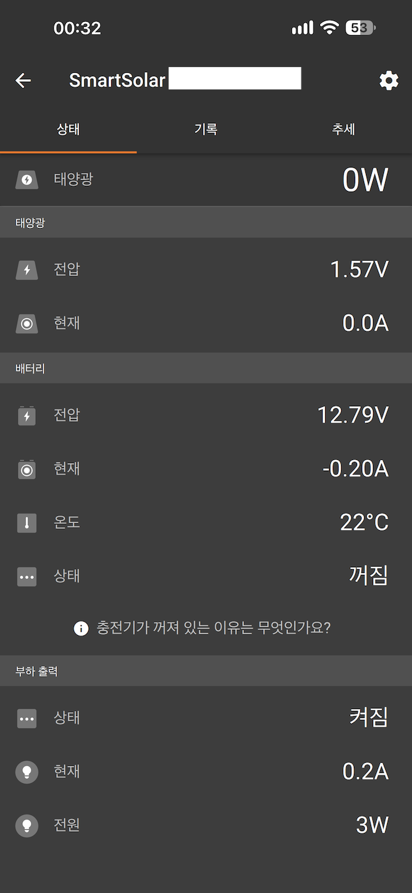
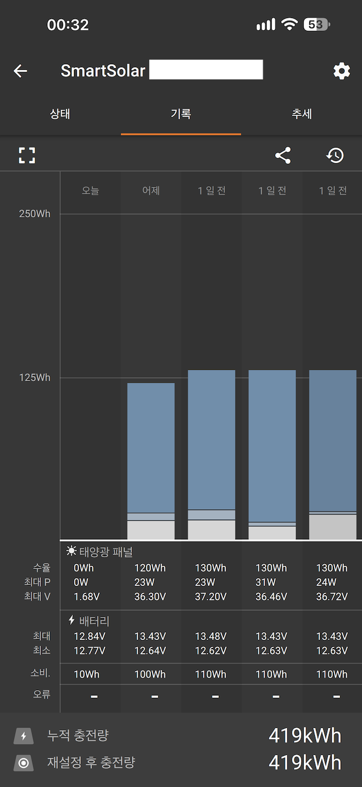

# victron-ble-mqtt

Local bridge: an ESP32 (Adafruit HUZZAH32) decrypts Victron Instant Readout BLE advertisements, publishes MQTT JSON, and opens a short GATT session only when it needs daily history or PV registers.

Most of the time it just listens to advertisements and publishes a 10-second average. A `hist` or `pv` command connects to the MPPT, reads the values, and disconnects.

> Sample values are anonymized. Fill in Wi-Fi, MQTT, PIN, MAC, and Instant Readout keys only on your machine.

## Credits

Built with [SuperGrok](https://grok.com) by capturing VictronConnect BLE Instant Readout advertisements and GATT hist/pv packets, then matching handshake and registers against HUZZAH32 serial logs. Instant Readout layout follows Victron's published Extra Manufacturer Data. Not an official SDK or sample.

## Screenshots

Local dashboard vs VictronConnect. App serial numbers are redacted.

Live values were taken at different times, so they will not line up. **Compare closed days only (yesterday and the day before).** This project reads GATT `hist` for **yesterday (day1)** only. Older days are whatever was already stored.

### Local dashboard


`victron_mqtt_view.py` — http://127.0.0.1:8772

### VictronConnect status



Live PV voltage, battery voltage, and temperature are reference only (time offset).

### VictronConnect history



| Day | Yield | Max P | Max Vpv | Battery max/min | Consumed |
|---|---|---|---|---|---|
| Yesterday | 120 Wh | 23 W | 36.30 V | 13.43 / 12.64 V | 100 Wh |
| Day before | 130 Wh | 23 W | 37.20 V | 13.48 / 12.62 V | 110 Wh |

Yesterday matches GATT `hist` day1. The day before is a closed day already on the dashboard and in the app history.

## Layout

```
SmartSolar MPPT 75/15  ──BLE ADV (AES-128-CTR)──┐
Smart Battery Sense    ──BLE ADV (AES-128-CTR)──┤
                                                ▼
                                       HUZZAH32 Feather
                                       ADV 10s + GATT burst
                                                │ MQTT
                                                ▼
                             broker ──┬── victron_poll.py      yesterday hist + 10-min PV
                                      ├── victron_mqtt_view.py local dashboard :8772
                                      ├── yard_time_pub.py     KST epoch → yard/time
                                      └── (optional) InfluxDB
```

## Hardware / libraries

- Adafruit HUZZAH32 (ESP32 Feather)
- Arduino IDE board: `Adafruit ESP32 Feather`
- NimBLE-Arduino 2.x
- PubSubClient
- Example devices: SmartSolar MPPT 75/15, Smart Battery Sense

## Files

```
victron_gatt_bridge_feather.ino   ESP32 firmware (ADV + GATT)
config.example.h                  secrets template (local only)
LICENSE                           MIT
README.md                         English (default)
README.ko.md                      Korean
victron_poll.py                   yesterday hist + 10-min PV + today consumption estimate
victron_mqtt_view.py              local dashboard http://127.0.0.1:8772
yard_time_pub.py                  Feather clock helper (yard/time)
victron-poll.service              systemd user unit
victron_days.json                 sample daily history
.env.example                      host MQTT/Influx template
dashboard.png                     local dashboard
app-status.png                    VictronConnect status (comparison)
app-history.png                   VictronConnect history (comparison)
.gitignore
```

## Do not commit

Keep these off GitHub:

- Wi-Fi SSID / password
- MQTT host, user, password
- Victron BLE PIN
- Device serial / MAC
- Instant Readout AES-128 key (16 bytes)
- InfluxDB token (`influx.token`, `influx.env`)
- Real home-directory paths

`.gitignore` already covers `config.h`, `.env`, `influx.token`, `*.log`, `victron_store/`.

Example PIN is `000000`. Example AES key is sixteen `0x00` bytes.

The Instant Readout key is not generated here. Copy it per device from VictronConnect into `g_dev[].key`.

Anyone with the key and PIN can read that charger or sensor.

## Setup

Firmware (`victron_gatt_bridge_feather.ino` header or `config.example.h`):

```
WIFI_SSID=YOUR_WIFI_SSID
WIFI_PASS=YOUR_WIFI_PASSWORD
MQTT_HOST=YOUR_MQTT_HOST
MQTT_PORT=1883
MQTT_USER=YOUR_MQTT_USER
MQTT_PASS=YOUR_MQTT_PASSWORD
MQTT_CLIENT=victron-gatt-bridge
VICTRON_PIN=000000
```

Devices (MAC is 12 lowercase hex chars, no colons):

```
mppt  SN=YOUR_MPPT_SN   MAC=aabbccddeeff  KEY=00…00
sense SN=YOUR_SENSE_SN  MAC=112233445566  KEY=00…00
```

### Instant Readout AES key

This project does not create the AES-128 key. **Copy it per device from the VictronConnect app** into `g_dev[].key`. It is not shared across a model.

1. Connect to the device in VictronConnect (PIN).
2. Settings (gear) → menu → **Product Info**
3. Enable **Instant Readout via Bluetooth**
4. **Show** next to **Instant Readout Details**
5. Copy the advertisement key (32 hex chars = 16 bytes) and the MAC
6. Paste into `g_dev[].macHex` / `g_dev[].key` (local only)

Copy MPPT and Sense keys separately. Leave `0x00` × 16 on GitHub. Resetting the Bluetooth PIN can change the key — copy it again from the app.

Host environment or `.env`:

```
MQTT_HOST=YOUR_MQTT_HOST
MQTT_USER=YOUR_MQTT_USER
MQTT_PASSWORD=YOUR_MQTT_PASSWORD
INFLUX_URL=http://127.0.0.1:8086
INFLUX_ORG=your-org
INFLUX_BUCKET=victron
INFLUX_TOKEN=YOUR_INFLUX_TOKEN
```

## MQTT topics

| Topic | Dir | Payload |
|---|---|---|
| `victron/mppt` | pub | ADV 10 s average (vbat, ibat, power, yield_wh, load_a, state) |
| `victron/sense` | pub | ADV 10 s average (vbat, temp) |
| `victron/status` | pub | board status (mode, rssi, clock, nvs, wifi, uptime) |
| `victron/mppt/hist` | pub | daily history (today / yesterday) |
| `victron/mppt/pv` | pub | GATT PV (vpv, ppv, ipv). missing fields are null |
| `victron/gatt/cmd` | sub | `{"cmd":"hist"}` / `{"cmd":"pv"}` / `{"cmd":"unpair"}` |
| `victron/lwt` | pub | online / offline (retain) |
| `yard/time` | sub | `{"epoch":..., "kst":"..."}` NTP helper |

## Behavior

1. **ADV** — decrypt manufacturer data CID `0x02E1`, record `0x10` with AES-128-CTR and publish a 10 s average.
2. **hist** — **yesterday only (day1, `0x1051`)**. Needs a KST date from NTP or `yard/time`. Skip GATT if NVS already has yesterday. Otherwise read the yesterday page, store it in NVS, and disconnect. Today's row is live ADV (yield, Pmax, Vbat) plus a consumption estimate.
3. **pv** — read `0xEDBB` / `0xEDBC` / `0xEDBD`, publish `victron/mppt/pv`, disconnect.
4. **unpair** — drop the bond and NVS history.

## Firmware

1. Copy Instant Readout key and MAC from VictronConnect into the sketch header (or a local `config.h`).
2. In Arduino IDE select `Adafruit ESP32 Feather` and upload.
3. The Feather uses `pool.ntp.org` / `time.google.com` and `yard/time`.

## Host

```bash
python3 -m pip install paho-mqtt
cp .env.example .env
python3 yard_time_pub.py
python3 victron_poll.py
python3 victron_mqtt_view.py
# dashboard http://127.0.0.1:8772
```

`victron_poll.py`: after 00:15, if yesterday hist is missing, retry `hist` every 10 minutes. If MPPT state is not `off`, request `pv` every 10 minutes. Today's consumption is the ADV `load_a × vbat` integral; once today's yield appears it switches to yesterday's consumed/yield ratio.

See `victron-poll.service` for a systemd user unit. Adjust `WorkingDirectory` / `ExecStart`.

InfluxDB is optional. Token comes from `INFLUX_TOKEN` or a gitignored `./influx.token`.

## License

[MIT](LICENSE).

Not an official Victron SDK. Victron and VictronConnect are trademarks of Victron Energy.
